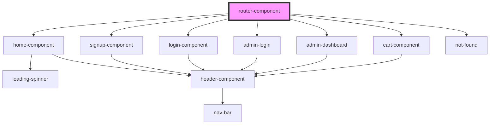

# router-component

<!-- Auto Generated Below -->

## Dependencies

### Depends on

- [home-component](../home-component)
- [signup-component](../signup-component)
- [login-component](../login-component)
- [admin-login](../admin-login)
- [admin-dashboard](../admin-dashboard)
- [cart-component](../cart-component)
- [not-found](../not-found)

### Graph

----------------------------------------------

*Built with [StencilJS](https://stenciljs.com/)*
